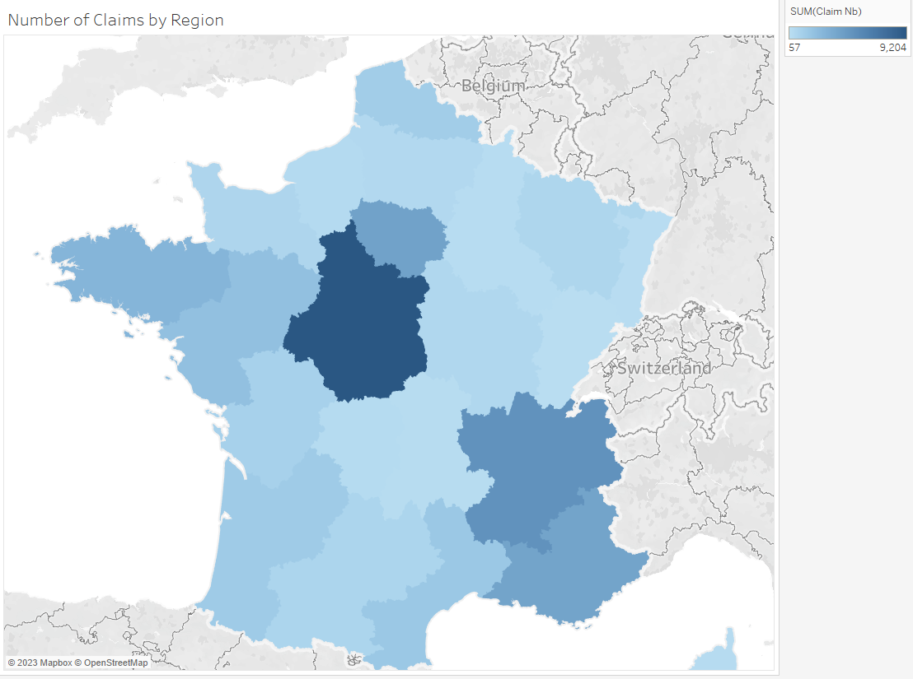

```{r include=FALSE}
library(CASdatasets)
library(OpenML)
library(farff)
library(tidyverse)
library(tidymodels)
library(ggplot2)

data <- OpenML::getOMLDataSet(data.id = 41214)

cars <- data$data
```

## Project Report

The field of insurance pricing has witnessed a significant evolution in modeling techniques over the years, with a transition from traditional regression methods to more sophisticated models such as Generalized Linear Models (GLMs) and, most recently, Deep Learning (DL) models.

Regression, as the earliest and simplest form of modeling, was a popular choice for insurance pricing due to its ease of interpretation and implementation. However, it struggled to handle the complexities of insurance data, which often include non-linear relationships and heterogeneous risk profiles. Consequently, Generalized Linear Models emerged as a significant advancement, offering a more flexible framework that accommodated various distribution families and link functions. GLMs excelled in modeling discrete and continuous outcomes while retaining interpretability, making them the go-to choice for many years.

Deep Learning models have recently taken the insurance industry by storm, ushering in a new era of predictive accuracy. These neural networks, with their multilayered architecture, can capture intricate patterns in massive datasets, including high-dimensional data, unstructured data, and temporal data. DL models have demonstrated remarkable capabilities in feature extraction, non-linear relationship modeling, and prediction accuracy. They are capable of handling diverse data types, such as images, text, and tabular data, which is particularly valuable in the age of big data.

However, the transition from GLMs to Deep Learning is not without its challenges. While DL models excel in predictive performance, they often sacrifice interpretability, which is a crucial requirement in the insurance industry for regulatory compliance and trustworthiness. Additionally, DL models require substantial computational resources and large datasets for effective training, which may pose scalability issues for some insurance companies. Ensuring model fairness and avoiding bias in DL models remains an active area of research, as it is crucial for ethical underwriting and compliance.

$$
\mu(y) = \beta_0 + \beta_1x_1 +... \Sigma_{i=1}^na_ix^i 
$$

In conclusion, the evolution from regression to Generalized Linear Models and finally to Deep Learning models in insurance pricing has been driven by the need for increased accuracy and the ability to model complex, non-linear relationships within diverse and large datasets. Each model paradigm has its unique strengths and limitations, making it important for insurers to carefully choose the most appropriate modeling technique for their specific needs and constraints. While Deep Learning holds great promise for the future of insurance pricing, it is essential to maintain a balance between predictive power and interpretability while addressing ethical concerns and data-related challenges.

<center>

```{r echo=FALSE, fig.cap = "Correlation Heatmap of Features"}
par(mfrow = c(1,1))
cars1<-cars %>% 
  mutate(across(where(is.factor), ~ as.numeric(unclass(.)))) %>% 
  mutate(VehGas = as.numeric(VehGas == "Diesel"))

cor(cars1 %>% select(-IDpol)) %>% 
  heatmap(keep.dendro = TRUE)
```
 
\newpage


</center>

<center>



</center>


## References

<div id="refs"></div>